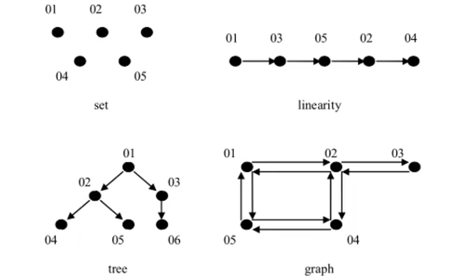

<!--
 * @Since: 2020-01-31 15:12:09
 * @Author: shy
 * @Email: yushuibo@ebupt.com / hengchen2005@gmail.com
 * @Version: v1.0
 * @Description: -
 -->

# 数据结构与算法

## 数据结构与算法入门

### 基本概念

- 数据结构是一门研究**组织数据方式**的学科。

- 程序 = 数据结构 + 算法

- 数据结构是算法的基础。

- **数据**

  数据（ `data` ）是描述客观事物的数值、字符以及能输入机器且能被处理的各种符号的集合。数据的含义非常广泛，除了通常的数值数据、字符、字符串数据以外，声音图像等一切可以被输入计算机并处理的都是数据。

  例如，除了表示人的姓名、身高、体重等字符、数字是数据，人的照片、指纹、三维模型、语音指令等也是数据。

- **数据项**

    数据项（ `data item` ）具有原子性，是不可分割的最小单位；
    如描述学生相关信息的姓名、性别、学号等都是数据项；三维坐标中的每一维坐标值也是数据项。

    下图中的 `红色` 部分都是一个数据项。

- **数据元素**

    数据元素（ `data element` ）是数据的基本单位，是数据集合的个体，通常由若干个数据项组成，在计算机中通常作为一个整体来处理。

    例如，一条描述一位学生的完整信息的数据记录就是一个数据元素；空间中一点的三维坐标也可以是一个数据元素。

    下图中 `蓝色` 部分即表示一个数据元素。

- **数据对象**

    数据对象（ `data object` ）是性质相同的数据元素的集合，是数据的子集。

    例如一个学校的所有学生的集合就是数据对象，空间中所有点的集合也是数据对象。

    下图中 `黄色` 部分即为一个数据对象。


    <center>红色：数据项 蓝色：数据元素 黄色：数据对象</center>

- **数据结构**

    数据结构（data structure）是指相互之间存在一种或多种特定关系的数据元素的集合。即数据元素的组织形式。

    数据结构的 2 中表现形式：

    一种数据结构的逻辑层面，即 `数据结构的逻辑结构` ；

    一种是存在于计算机世界的物理层面，即 `数据的存储结构` ；

    所有的数据结构在物理的存储上只有**数组**和**链表**2中方式；

    <center>数据结构 = 逻辑结构 + 物理结构 + （在存储结构上的）运算/操作</center>

    

### 数据结构类型

    数据的逻辑结构是指数据元素之间的逻辑关系（与实现无关）。

- **分类一：线性结构与非线性结构**

    线性结构：有且只有一个开始节点与终端节点，并且所有节点都最多只有一个直接前驱和一个直接后继。

    线性表就是一个典型的线性结构，它有四个基本特征：

    1.  集合中必须存在一个唯一的“第一个元素”；
    2.  集合中必须存在一个唯一的“最后一个元素”；
    3.  除最后一个元素外，其它数据元素均有唯一的“后继”；
    4.  除第一个元素外，其它数据元素均有唯一的“前驱”；

    

    生活案例：冰糖葫芦、排队上地铁

    相对于线性结构，非线性结构的逻辑特征是一个节点元素可能对应多个直接前驱和多个直接后继。

    常见的非线性结构有：树（二叉树等）、图（网等）。

    

    树：生活案例有单位组织架构、族谱等，技术案例如文件系统。

- **分类二：集合结构 线性结构 树状结构 网络结构**

    逻辑结构有四种基本类型：集合结构、线性结构、树状结构和网络结构。

    表和树是两种最常用的高效的数据结构，许多高效的算法能够用这两种数据结构来设计实现。

    集合结构：就是数学中所学习的集合。集合中的元素有三个特征：

    1. 确定性。集合中的元素必须是可以确定的。
    2. 唯一性。集合中的元素互不相等。
    3. 无序性。集合中的元素没有先后之分。

    该数据结构的元素之间的关系是“属于同一个集合”，别无其它关系。

    因为集合中元素的关系很弱，数据结构中不对该结构进行研究。

    线性结构：指元素之间存在“一对一”的线性关系。

    树状结构：除了一个数据元素（根节点）以外，每个数据元素有且仅有一个直接前驱，但可以有多个后续元素。特点是数据元素间是“一对多”的关系。

    网状结构：每个数据元素都可以有多个直接前驱和多个直接后续元素。数据元素之间是“多对多”的关系。

    

- **数据的存储结构**

    数据的存储结构主要包括数据元素本身的存储以及元素之间关系的表示，是数据的逻辑结构在计算机中的表示。

    常见的存储结构有顺序存储、链式存储、索引存储、散列存储。

    - **顺序存储结构**

        把逻辑上相邻的节点存储在物理位置上相邻存储单元中，节点之间的逻辑关系由存储单元邻接关系来体现。由此得到的存储结构为顺序存储结构，通常顺序存储结构是借助于计算机程序设计语言的数组来描述。数据元素的存储对应于一块连续的存储空间，数据元素之间的前驱和后续关系通过数据元素在存储器中的相对位置来反映。

        

        优点是节省存储空间。因为不需要额外存储数据元素间的关系信息。采用该存储方法可实现对节点随机存取，即每个节点对应一个序号，由该序号可直接计算出节点的存储地址。

        缺点是插入和删除操作需要移动元素，效率较低。

    - **链式存储结构**

        数据元素的存储对应的不是连续的存储空间。每个节点是由数据域和指针域组成。元素之间的逻辑关系通过指针来体现。特点如下：

        1. 比顺序存储结构的存储密度小，由于还需要存储元素关系信息，因此占用存储空间比顺序存储大（不一定，因为数组需要提前分配）；
        2. 逻辑上相邻节点在存储位置上不必相邻；
        3. 插入、删除节点灵活，不需要移动存储位置，只需要修改相应的指针；
        4. 查找节点时链式存储比顺序存储慢。

        

    - **索引存储结构**

        除了建立存储节点信息外，还要建立附加的索引表来标识节点的地址。比如图书、字典的目录。

        

    - **散列存储结构**

        根据节点的关键字直接计算出该节点的存储位置。一种神奇的结构，添加、查询速度最快，好比数组中按照索引查找元素。

        

    同一种逻辑结构可以通过不同的存储结构来实现。比如线性表可以使用顺序表和链表的存储结构实现。同一逻辑结构，不同的存储结构下相同的操作的实现方式不一样。运算永远针对的是存储结构。

    

### 算法（Algorithm）

- **概念**

    算法是指令的集合，是为解决特定问题而规定的一序列的操作。

    它是明确定义的可计算的过程，以一个数据集合作为输入，并产生一个数据集合作为输出。

    一个算法通常来说具有以下五个特征：

    1. 输入：一个算法应以待解决问题的信息作为输入；
    2. 输出：输入对应指令集合处理后的信息；
    3. 可行性：算法是可行的，即算法中每一条指令都是可以实现的，均能在有限的时间内完成；
    4. 有穷性：算法执行的指令个数是有限的，每个指令又是在有限的时间内完成的，因此整个算法又是在有限的时间内完成的；
    5. 确定性：算法对于特定的合法输入，其对应的输出也是唯一的。即算法从一个特定的输入开始，多次执行同一指令集结果总是相同的。

    简单的来说，算法就是解题的过程。

    算法的优劣评价采用时间复杂度与空间复杂度来表示。计算机最重要的资源就是时间资源与空间资源。

- **时间复杂度（Time complexity）**

    即完成算法所需要的计算工作量。

    - `时间频度` 。一个算法执行所消耗的时间，从理论上说是不能算出来的，必须上机运行才能知道。一个算法花费的时间与算法中语句执行的次数成正比。一个算法中语句执行的次数称为语句频度或时间频度，表示为T(n)，n表示为问题的规模。

    - `时间复杂度` 。体现的是问题的规模。一般情况下，算法中基本重复执行次数是问题规模n的某个函数，用T(n)表示，若有某个辅助函数f(n)，当n趋近无穷大时，T(n)/f(n)的极限值为不等于0的常数，则称f(n)是T(n)的同数量级函数。记作T(n)=O(f(n))，称O(f(n))为算法的渐进时间复杂度，简称时间复杂度。

        <center>T(n)=O(f(n))</center>

        或者说：**时间复杂度就是时间频度去掉低阶项和首项常熟。**

        注意：时间频度与时间复杂度是不同的，时间频度不同但时间复杂度可能相同。

        比如：某两个算法的时间频度是 $T(n)=100000n^2+10n+6 T(n)=n^2$，但是时间复杂度都是$T(n)=O(n^2)$

    - `最坏时间复杂度与平均时间复杂度`

        最坏情况下的时间复杂度称最坏时间复杂度。一般不特别说明，讨论的时间复杂度均是最坏时间复杂度。表示对于任何输入实例，该算法的时间不会大于该值。

        平均时间复杂度是指所有可能输入实例均以等概率出现的情况下，算法期望的运行时间。鉴于平均时间复杂度难以计算，且很多算法平度时间复杂度与最坏时间复杂度是一样的，因此我们一般只讨论最坏时间复杂度。

        

    - `时间复杂度的计算`

        1. 用常数1代替运行时间中所有的加法常数项；如：$T(n)=100000n^2+10n+6$  ==>  $T(n)=100000n^2+10n+1$
        2. 修改后运行次数函数中，只保留最高阶项； 如：$T(n)=100000n^2+10n+1$   ==>  $T(n)=100000n^2$
        3. 去除最高阶项的系数；                如：$T(n)=100000n^2$   ==>  $T(n)=n^2$
        4. 用 O 记号表示算法的时间性能；        如：$O(n^2)$

    - `常用时间复杂度级别`

        - 常数阶：$O(1)$：无论程序执行了多少行，只要没有循环等复杂结构，那么其时间复杂度就是常数阶；
        - 对数阶：$O(log_rn)$：循环体中，循环变量以2的倍数递增接近循环条件n；
        - 线性阶：$O(n)$：循环体中，循环变量以每次加1递增；
        - 线性对数阶：$O(nlog_rn)$：双重循环中，一个循环以对数增长，一个以线性增长；
        - 平方阶：$O(n^2)$：双重循环中，内外层循环均以线性增长；
        - 立方阶：$O(n^3)$：三层循环中，每层循环均以线性增长；
        - k次方阶：$O(n^k)$：k层循环中，每层循环均以线性增长；
        - 指数阶：$O(2^n)$
        - 阶乘阶：$O(n!)$

- **空间复杂度（Space Complexity）**

    即完成这个算法所需的内存空间。

    算法的存储量包括：

    1. 程序本身所占用的空间；
    2. 输入数据所占用的空间；
    3. 辅助变量所占用的空间；

    输入数据所占用的空间只取决于问题本身，和算法无关，则**只需要分析拆除输入和程序之外的辅助变量所占用的额外空间**。

    空间复杂度是对一个算法运行过程中临时占用的存储空间大小的量度，一般也作为问题规模n的函数，以数量级函数给出，记作：$S(n) = O(g(n))$

    注意：

    1. 空间复杂度比时间复杂度分析要少；
    2. 对于递归算法来说，代码一般都比较简短，算法本身所占用的存储空间较少，但运行时需要占用较多的临时工作单元；若写成非递归算法，代码一般可能比较长，算法本身所占用的存储空间较多，但运行时需要较少的存储单元。

## 线性表（linear list）

线性表是n个类型相同数据元素的有限序列，通常记作：（a_0, a_1, ... a_i-1, a_i, a_i+1, ... a_n-1）

- `相同数据类型`

    在线性表的定义中，数据元素的类型是相同的，意味着在内存存储时，每个元素会占用相同的内存空间，以便后续的查询定位。

- `序列（顺序性）`

    在线性表的相邻数据元素之间存在序偶关系。

- `有限性`

    线性表中的数据元素个数是有限的。

线性表的存储结构有2种：**顺序表和链表**。

其中，顺序表类似于数组，为一块连续的存储空间，不需要额外存储空间来存储节点的关系。

### 稀疏数组（sparsearray | me.shy.demo.sparsearray.Chess.java）

  

  当一个数组中大部分元素为同一个值时，可采用稀疏数组来保存：
  1. 其中一行（比如第一行）记录数组中一共有几行几列，有多少个有效值；
  2. 把具有不同值的元素的行列及值记录在一个小规模的数组中，从而节省程序的存储空间；

  例子如下：
  

### 队列（Queue | me.shy.demo.queue.CycleArray.java）

- 队列是一个有序列表，可以使用数组和链表实现；
- 遵循**先进先出**的原则；
- 从队列前端入队，从队列尾部出队；

### 链表（LinkedList | me.shy.demo.list.UnidirectionalLinkedListDemo.java）

- 链表是一种有序列表，但在内存中存储的方式与数组不一样，并非连续的，而是分为2部分，一部分存储数据，另一部分则存放指向下一个节点的地址；
- 链表可分为单向链表，双向链表，单向循环链表与双向循环链表；
- 面试题（`me.shy.demo.list.UnidirectionalLinkedListInterviewDemo.java`）：

  1. 求单链表中有效节点的个数（新浪）；
  2. 查找单链表中倒数第k个节点（新浪）；
  3. 单链表的反转（腾讯）；
  4. 从尾到头打印单链表（百度，要求：方式1：反向遍历；方式2：栈）；
  5. 合并2个有序的单链表，合并后依然有序；

### 双向链表

- 单向链表只能朝一个方向遍历查找；而双向链表可以向前或者向后查找；
- 单向链表不能自我删除，只能靠辅助节点来完成，删除时总是要找到待删除的前一个节点来完成；
  ```java
  // 待删除的链表为 temp
  // 将待删除节点的前一个节点的 next 指向待删除节点的后一个节点
  temp.pre.next = temp.next;
  // 当 temp 不为最后一个节点时，将待删除节点的后一个节点的 pre 指向待删除节点的前一个节点
  if (temp.next != null ) {
      temp.next.pre = temp.pre;
  }
  ```
- 双向链表可以自我删除，不用辅助节点；

### 单向循环链表（me.shy.demo.list.JosephusDemo.java）

约瑟夫问题（Josephus Problem）

据说著名犹太历史学家Josephus有过以下的故事：在罗马人占领乔塔帕特后，39 个犹太人与Josephus及他的朋友躲到一个洞中，39个犹太人决定宁愿死也不要被敌人抓到，于是决定了一个自杀方式，41人排成一个圆圈，由第1个人开始报数，每报数到第3人该人就必须自杀，然后再由下一个重新报数，直到所有人都自杀身亡为止。然而Josephus 和他的朋友并不想遵从。首先从一个人开始，越过k-2个人（为第一个人已经被越过），并杀掉第k个人。接着，再越过k-1个人，并杀掉第k个人。这个过程沿着圆圈一直进行，直到最终只剩下一个人留下，这个人就可以继续活着。问题是，给定了和，一开始要站在什地方才能避免被处决。Josephus要他的朋友先假装遵从，他将朋友与自己安排在第16个与第31个位置，于是逃过了这场死亡游戏。

17世纪的法国数学家加斯帕在《数目的游戏问题》中讲了这样一个故事：15个教徒和15 个非教徒在深海上遇险，必须将一半的人投入海中，其余的人才能幸免于难，于是想了一个办法：30个人围成一圆圈，第一个人开始依次报数，每数到第九个人就将他扔入大海，如此循环进行直到仅余15个人为止。问怎样排法，才能使每次投入大海的都是非教徒。

### 栈（Stack | me.shy.demo.stack.*.java）

栈是一种先进后出的有序列表。只能从栈顶入栈（push）和出栈（pop）。

应用场景：
1. 表达式计算；
2. 方法调用、递归等；
3. 中缀表达式转后缀表达式；
4. 二叉树遍历；
5. 图的深度优先搜索；

- 中缀表达式：即操作符位于操作数之间，就是我们常见的算术表达式，对人类友好，但对计算机不友好；

- 前缀表达式（波兰表达式）：操作符位于操作数之前，没有括号；例如，表达式 (3+4)x5-6 对应的前缀表达式为：- x + 3 4 5 6

**求值方式**：从**右至左**扫描表达式，遇到数字时，将数字压入栈，遇到运算符时，弹出栈顶的2个数，用运算符对它们做相应的计算，并将结果压入栈中，重复上述过程直到表达式最左端，最后运算得出的结果即为表达式的值。

- 后缀表达式（逆波兰表达式）：与前缀表达式类似，只是操作符位于操作数之后；例如，表达式 (3+4)x5-6 对应的后缀表达式为：3 4 + 5 x 6 -

**求值方式**：从**左至右**扫描表达式，遇到数字时，将数字压入栈，遇到运算符时，弹出栈顶的2个数，用运算符对它们做相应的计算，并将结果压入栈中，重复上述过程直到表达式最右端，最后运算得出的结果即为表达式的值。

- 中缀表达式转后缀表达式的步骤：

  1. 初始化2个栈：操作符s1和结果栈s2；
  2. 从左至右扫描中缀表达式；
  3. 遇到操作数时，将其压入s2；
  4. 遇到操作符时，将其与s1栈顶的运算符进行比较：
     1. 如果s1为空，或者栈顶运算符为左括号，则直接将此运算符压入s1；
     2. 若优先级比栈顶运算符优先级高，将其压入s1；
     3. 若是同优先级或者更低的优先级，将s1栈顶运算符弹出并压入到s2中，再次转入**4.1**，与s1中新的栈顶元算符比较；
  5. 遇到括号时：
     1. 如果是左括号，直接将其压入s1；
     2. 如果是右括号，则依次弹出s1顶的运算符，并压入s2，直到遇到左括号为止，然后将这一对括号丢弃；
  6. 重复步骤**2-5**，直到表达式的最右边；
  7. 将s1中剩余的运算符依次弹出并压入s2；
  8. 依次弹出s2中的元素并输出，**结果的逆序**即为对应中缀表达式的后缀表达式。

**注意**：因为s2这个栈在整个操作中没有弹栈操作，而且最后的结果还要逆序输出，因此实际中第二个栈完全可以使用数组或者List来代替。

**例子：**将中缀表达式：**1+((2+3)x4)-5**转为后缀表达式：**1 2 3 + 4 x + 5 -**，过程如下图：


### 递归（Recursion | me.shy.demo.recursion.*.java）

递归，即方法内调用自身，每次传入的变量不一样，有助于编程者解决复杂的问题。

使用递归需遵行的原则：
1. 调用一个方法时，就会创建一个新的独立的受保护的栈空间；
2. 方法的局部变量位于不同的栈空间中，不会相互影响，但如果使用的是引用类型的数据，则指向同一份引用；
3. 递归必须向退出递归条件的方向逼近，否则就会形成无限递归，造成栈空间溢出；
4. 当一个方法执行完毕或者碰到 return 语句时就会返回，遵循谁调用就返回给谁，同时结束该方法；

应用场景：
1. 各种数学问题。如8皇后问题、汉诺塔问题、阶乘问题、迷宫问题等；
2. 各种算法中也会用到递归，如快速排序、归并排序、二分查找和分治算法等；
3. 用栈解决的问题使用递归实现代码会比较简介；

### 排序算法（Sort Algorithm | me.shy.demo.sort.*.java）

排序是指将一组数据依照指定的顺序进行排列的算法。

排序分为内部排序和外部排序。内部排序是指将数据加载到内部存储中完成排序，而外部排序是指数据量过大，无法全部加载至内存中，需要借助外部存储进行排序。

排序算法分类如下：


各种排序算法的时间复杂度：


- 冒泡排序（Bubble Sorting | `me.shy.demo.sort.BubbleSorter.java`）

 通过对要排序的序列从前往后（索引较低的在前面），依次拿出相邻的2个元素进行比较，若发现逆序，则交换2个元素的位置。
 当遍历一次序列后，最后一个数就是序列中的最大数；

假设总序列数为 n，则：

1. 总共要进行 n-1 次趟排序；
2. 每趟排序的所要遍历的元素逐次减少1个；

 **优化：**若某次遍历下来发现没有任何交换发生，则说明序列已经有序，可提前结束。

- 选择排序（Select Sorting | `me.shy.demo.sort.SelectSorter.java`）

假设有 n 个元素的序列 array：
1. 第一轮从 array[0] - array[n-1] 中选择最小（按从小到大的顺序排列）的与 array[0] 进行交换；
2. 第二轮从 array[1] - array[n-1] 中选择最小（按从小到大的顺序排列）的与 array[1] 进行交换；
3. 第i轮从 array[i-1] - array[n-1] 中选择最小（按从小到大的顺序排列）的与 array[i-1] 进行交换；

规则：
1. 总共要进行 n-1 轮排序；
2. 每一轮排序中又是一个循环：
在循环中，先假定当前元素是最小的，依次与后面的元素对比，若发现更小的，就将当前的最小的更新为新发现的那个，并记录索引；
当元素对比完成后，就将找到的最小元素与当前要交换的元素进行交换；

- 插入排序（Insertion Sorting | `me.shy.demo.sort.InsertionSorter.java`）

插入排序是指对欲排序的元素以插入的方式寻找该元素适当的位置，以达到排序的目的。

把 n 个待排序的元素看成一个有序表和一个无序表，**开始时有序表只包含一个元素，无序表中包含 n-1 个元素**，排序时依次从无序表中取出第一个元素，把其排序码依次与有序表中元素的排序码进行比较，将其插入有序表中适当的位置，使其成为新的有序表。

**存在的问题**：当插入的数较小的时，数组后移的次数较多，对效率有影响。

- 希尔排序（Shell Sorting | `me.shy.demo.sort.*ShellSorter.java`）

希尔排序也是一种插入排序，也称为缩小增量排序。与简单的插入排序不同的是，希尔排序先将序列按下标进行分组，然后每一组里面使用简单插入排序算法；随着分组数逐渐减少，每组越来越有序，当分组减至1是，整个序列恰好被分成一组，算法变终止，希尔排序解决了简单插入排序的存在的问题，即当插入的数较小的时，数组后移的次数较多。希尔排序在处理有序数据插入时有**交换**和**移动**两种办法。

- 快速排序（Quick Sorting | `me.shy.demo.sort.QuickSorter.java`）

快速排序是对冒泡排序的一种改进。其基本思想是：通过一次排序将要排序的序列分割成2个部分，其中一部分数据比另一部分的数据都要小，然后再按照此方法分别对2部分数据进行排序，整个排序过程可以递归进行，一次达到将整个序列变成有序序列。

排序算法的思想非常简单，在待排序的数列中，我们首先要找一个数字作为基准数（这只是个专用名词）。为了方便，我们一般选择第 1 个数字作为基准数（其实选择第几个并没有关系）。接下来我们需要把这个待排序的数列中小于基准数的元素移动到待排序的数列的左边，把大于基准数的元素移动到待排序的数列的右边。这时，左右两个分区的元素就相对有序了；接着把两个分区的元素分别按照上面两种方法继续对每个分区找出基准数，然后移动，直到各个分区只有一个数时为止。

- 归并排序（Merge Sorting | `me.shy.demo.sort.MergeSorter.java`）

归并排序是利用归并的思想实现的排序方法，该算法采用经典的**分治（divide-and-conquer）策略**（分治法将问题**分(divide)**成一些小的问题递归求解，而**治(conquer)**的阶段则是将分的阶段得到的各种答案修补到一起，即分而治之）。归并排序可采用递归和迭代来实现。

示意图如下：


- 基数排序（Radix Sorting | `me.shy.demo.sort.RadixSorter.java`）

基数排序(RadixSort)是在桶排序的基础上发展而来的，两种排序都是分配排序的高级实现。分配排序(DistributiveSort)的基本思想：排序过程无须比较关键字，而是通过“分配”和“收集”过程来实现排序。它们的时间复杂度可达到线性阶：O(n)。

基数排序是一种稳定的排序算法，但有一定的局限性：
　　1、关键字可分解。
　　2、记录的关键字位数较少，如果密集更好。
　　3、如果是数字时，最好是无符号的，否则将增加相应的映射复杂度，可先将其正负分开排序。


桶排序也称为箱排序(BinSort)，其基本思想是：设置若干个桶，依次扫描待排序的记录R[0]，R[1]，…，R[n-1]，把关键字在某个范围内的记录全都装入到第k个桶里(分配)，然后按序号依次将各非空的桶首尾连接起来(收集)。

先来看一下桶排序(RadixSort)。

桶排序也称为箱排序(BinSort)，其基本思想是：设置若干个桶，依次扫描待排序的记录R[0]，R[1]，…，R[n-1]，把关键字在某个范围内的记录全都装入到第k个桶里(分配)，然后按序号依次将各非空的桶首尾连接起来(收集)。

例如，要将一副混洗的52张扑克牌按点数A<2<…<J<Q<K排序，需设置13个“桶”，排序时依次将每张牌按点数放入相应的桶里，然后依次将这些桶首尾相接，就得到了按点数递增序排列的一副牌。

桶排序中，桶的个数取决于关键字的取值范围。因此桶排序要求关键字的类型是有限类型，否则可能要无限个桶。

一般情况下每个桶中存放多少个关键字相同的记录是无法预料的，故桶的类型应设计成链表为宜。

为保证排序是稳定的，分配过程中装箱及收集过程中的连接必须按先进先出原则进行。

对于桶排序来说，分配过程的时间是O(n)；收集过程的时间为O(m)（采用链表来存储输入的待排序记录）或O(m+n)。因此，桶排序的时间为O(m+n)。若桶个数m的数量级为O(n)，则桶排序的时间是线性的，即O(n)。

前面说的几大排序算法，大部分时间复杂度都是O(n2)，也有部分排序算法时间复杂度是O(nlogn)。而桶式排序却能实现O(n)的时间复杂度。但桶排序的缺点是：首先是空间复杂度比较高，需要的额外开销大。排序有两个数组的空间开销，一个存放待排序数组，一个就是所谓的桶，比如待排序值是从0到m-1，那就需要m个桶，这个桶数组就要至少m个空间。其次待排序的元素都要在一定的范围内等等。

基数排序是对桶排序的一种改进，这种改进是让“桶排序”适合于更大的元素值集合的情况，而不是提高性能。

我们还是用扑克牌的例子来说明。一张牌有两个关键字组成：花色(桃<心<梅<方)+面值(A<2<3<4<...<K)。假如一张牌的大小首先被花色决定，同花色的牌有数字决定的话。我们就有两种算法来解决这个问题。

即两张牌，若花色不同，不论面值怎样，花色低的那张牌小于花色高的，只有在同花色情况下，大小关系才由面值的大小确定。这就是多关键码排序。

为得到排序结果，我们讨论两种排序方法。

方法1：先对花色排序，将其分为4个组，即梅花组、方块组、红心组、黑心组。再对每个组分别按面值进行排序，最后，将4个组连接起来即可。

方法2：先按13个面值给出13个编号组(2号，3号，...，A号)，将牌按面值依次放入对应的编号组，分成13堆。再按花色给出4个编号组(梅花、方块、红心、黑心)，将2号组中牌取出分别放入对应花色组，再将3号组中牌取出分别放入对应花色组，……，这样，4个花色组中均按面值有序，然后，将4个花色组依次连接起来即可。

多关键码排序按照从最主位关键码到最次位关键码或从最次位到最主位关键码的顺序逐次排序，分两种方法：

最高位优先(MostSignificantDigitfirst)法，简称MSD法：

1）先按k1排序分组，将序列分成若干子序列，同一组序列的记录中，关键码k1相等。

2）再对各组按k2排序分成子组，之后，对后面的关键码继续这样的排序分组，直到按最次位关键码kd对各子组排序后。

3）再将各组连接起来，便得到一个有序序列。扑克牌按花色、面值排序中介绍的方法一即是MSD法。

最低位优先(LeastSignificantDigitfirst)法，简称LSD法：

1)先从kd开始排序，再对kd-1进行排序，依次重复，直到按k1排序分组分成最小的子序列后。

2)最后将各个子序列连接起来，便可得到一个有序的序列，扑克牌按花色、面值排序中介绍的方法二即是LSD法。

对数字型或字符型的单关键字，可以看作由多个数位或多个字符构成的多关键字，此时可以采"分配-收集”的方法进行排序，这一过程称作基数排序法，其中每个数字或字符可能的取值个数称为基数。比如，扑克牌的花色基数为4，面值基数为13。在整理扑克牌时，既可以先按花色整理，也可以先按面值整理。按花色整理时，先按红、黑、方、花的顺序分成4摞（分配），再按此顺序再叠放在一起（收集），然后按面值的顺序分成13摞（分配），再按此顺序叠放在一起（收集），如此进行二次分配和收集即可将扑克牌排列有序。

在“分配-收集”的过程中，需要保证排序的稳定性。

基数排序的思想就是将待排数据中的每组关键字依次进行桶分配


### 查询算法

1. 顺序（线性）查找；
2. 二分/折半查找；
3. 插值查找；
4. 斐波那契查找；

- 顺序查找：即遍历要查找的序列，依次取出元素与要查找的值进行比较，直到相等就返回索引；如果序列遍历完后仍然没有找到，就返回-1，表示未找到
- 二分/折半查找：**要求要查找的序列必须有序**，采用递归思想，首先取出序列最中间的元素与待查找的值进行比较，如果中间值比要查找的值大，则表示待查找的值应该在序列的左边（假设序列从小到大，否则就是在序列的右边），需要向左递归（向左递归的意思是将右向索引变为中间索引减1）；如果中间值比要查找的值小，则表示待查找的值应该在序列的右边，需要向右递归（向右递归的意思是将左向索引变为中间索引加1）；如果中间元素与要查询的值刚好相等，直接返回；递归退出的条件有2个：已查询到目标元素或者序列遍历完未找到目标元素（即左向索引大于右向索引）
- 插值查找：插值查找是对二分查找的一种优化，二分查找的问题是如果刚好要查询的值是序列中最小或者最大时，也要从序列中间开始递归多次才能找到元素；插值查找是从自适应的索引（使用自适应梯度下降算法）处开始查找，将二分查找的中间索引公式：

    $mid=\frac {low + high}{2}$ = $low + \frac{1}{2}(high - low)$

    改成

    $mid = low + \frac{key - a[low]}{a[high] - a[low]}(high - low)$

    **其中 key 即是要查找的值**，对于数据量较大，元素分布较为均匀（跳跃性不大）时速度较快，但插值查找算法在最次的情况下也可以和二分查找相等。

    ```java
    // 求插值索引的方式
    // key 即为要查找的值
    int mid = low + (high - low) * (key - array[low]) / (array[high] - array[low])
    ```

- 斐波那契查找：也称黄金分割法，与二分和插值插值算法相似，仅仅是改变了中索引 mid 的计算方式，不再中间或者插值得到，而是位于黄金分割点附近，即：
$mid = low + F(k - 1) - 1$，其中，F表斐波那契数列的函数，k 为斐波那契数列的第 k 个值，对 F(k - 1)-1 的理解：

1. 由斐波那契数列 F(k) = f(k-1) + f(k-2) 的性质，可以得到 (F(k)-1) = (F(k -1)-1) + (F(k-2)-1) + 1。因此，只要序列的长度为 F(k)-1，则可将序列分为长度为 F(k-1)-1 和 F(k-2)-1 两段，从而中间位置为：mid = low+F(k-1)-1，如下图所示：

    

2. 类似的，每个子段也可以用上面的方式分割；
3. 但序列的长度 n 不一定刚好等于 F(k)-1，所以需要将序列的长度 n 增至 F(k)-1。这里的 k 值只要使得 F(k)-1 恰好大于或等于 n 即可。序列新增的元素（从 n+1 开始）都赋值为序列最后一位的值即可。

```java
while (n > fib(k) - 1){
    k++;
}
```

### 哈希表（Hash Table）

哈希表也叫散列表，是根据关键码值（Key - Value）进行直接访问的一种数据结构。它通过吧关键码映射到表中一个位置来访问记录，从而加快查找速度。这个映射的函数叫哈希函数（散列函数），存放记录的数组叫散列表。

TODO: 利用数组和 List 实现 HaseTable

### 树（Tree）
数组存储方式：
- 优点：通过下标访问元素，速度快，对于有序数组还可以通过二分查找方式提高检索速度；
- 缺点：如果要检索某个具体的值，或者按一定的顺序插入值需要整体移动，效率较低；同时，容量不够还需要扩容；

链表：
- 优点：插入删除效率高；
- 缺点：检索仍然需要遍历，效率较低；

树：能提高数据的存储、读取效率。比如，利用**二叉排序树（Binary Sort Tree）**既能保证数据的检索速度、同时也能保证数据的插入、修改和删除的效率；


#### 二叉树
- 每个节点最多只有2个子节点的的树称为二叉树；
- 二叉树的子节点分为左节点和右节点；
- 如果二叉树的**所有叶子节点都在最后一层，并且节点总数=$2^n - 1$**，n 为层数，则称为**满二叉树**；
- 如果二叉树的**所有叶子节点都在最后一层或者倒数第二层，并且最后一层的叶子节点在左边延续，倒数第二层的叶子节点在右边延续**，则称为**完全二叉树**；

##### 二叉树的遍历、查找（根据**父节点**的输出顺序）
- 前序遍历：先输出**父节点**，再遍历左子树和右子树；
- 中序遍历：先遍历左子树，再输出**父节点**，最后遍历右子树；
- 后序遍历：先遍历左子树，再遍历右子树，最后输出**父节点**；

##### 顺序存储二叉树
- 顺序存储二叉树是指用数组存储二叉树；
- 顺序存储二叉树为完全二叉树；
- 顺序存储二叉树的第 n 个节点（n 从0开始，也即底层数组的下标）的左子节点为：$2n+1$;
- 顺序存储二叉树的第 n 个节点（n 从0开始，也即底层数组的下标）的右子节点为：$2n+2$;
- 顺序存储二叉树的第 n 个节点（n 从0开始，也即底层数组的下标）为：$(n+1)/2$;
- 顺序存储二叉树的实际应用案例：堆排序

##### 线索化二叉树
- n 个节点的二叉链表含有 n+1 个（公式为：$2n-(n-1)=n+1$）个空指针域，利用二叉链表的空指针域，存放指向节点在**某次遍历次序**下的前驱和后继节点的指针（这种附加指针称为线索）；
- 这种加上了线索的二叉链表称为**线索链表**，相应的二叉树称为**线索二叉树（Threaded BinaryTree）**。根据线索的性质不同，线索二叉树可分为：**前序线索二叉树**、**中序线索二叉树**和**后序线索二叉树**三种；
- 一个节点的前一个节点称为**前驱节点**；
- 一个节点的后一个节点称为**后驱节点**；

**注意**：当线索化完二叉树后就不能再使用原来的方式（前序、中序以及后续）遍历了，会造成死循环。

#### 堆排序（Head Sort）
- 堆排序是利用**堆**这种数据结构而设计的一种排序算法。堆排序是一种**选择排序**，它的最坏、最好和平均时间复杂度均为$O(nlog_n)$，是一种不稳定的排序；
- **堆**是一种二叉树，它具备一下性质：每个节点的值都**大于或等于**其左右孩子节点的值（大顶堆），或者每个节点的值都**小于或者等于**其左右孩子节点的值（称为小顶堆）；
- 注意：以上要求中没有要求其左孩子节点和右孩子节点的关系；
- 一般升序采用大顶堆；降序采用小顶堆；
- 将堆按照层级映射为数组后，大顶堆的特点为：```array[i] >= array[2*i+1] && array[i] >= array[2*i+2]```；小顶堆的特点为：```array[i] <= array[2*i+1] && array[i] <= array[2*i+2]```


- 堆排序的基本思想（以生序排序为例）：
  1. 将待排序的序列构成大顶堆；
  2. 此时整个序列中最大值即为堆顶的根节点；
  3. 将其与末尾的元素进行交换，此时末尾的即为最大值；
  4. 然后将剩余的 n-1 个元素构成一个新的大顶堆，这样会得到 n 个元素的次小值。如此反复便能得到一个有序的序列了；

#### 赫夫曼树
